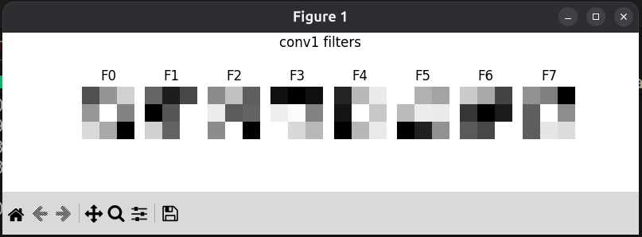
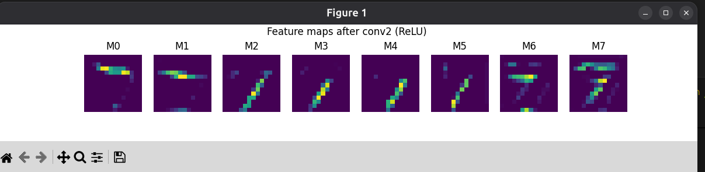

# CNN MNIST

A simple CNN for classifying handwritten digits from the MNIST dataset.

## Installation

```bash
pip install torch torchvision matplotlib numpy
```

## Usage

Train the model:
```bash
python train.py
```

Visualize results:
```bash
python visualize.py
```

## Visualizations

The visualization script shows learned filters and feature maps:






## Project Structure

```
project/
├── data/           # MNIST dataset
├── models/         # Saved model weights
├── train.py        # Training script
├── visualize.py    # Visualization tools
└── utils/          # Utility modules (model definition)
```
